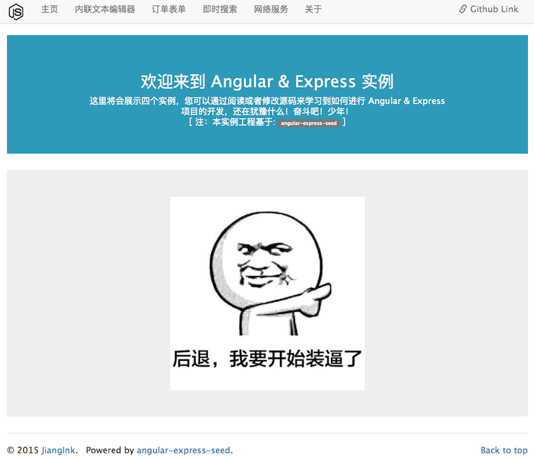

# angular-express-demo
Angular &amp; Express 项目实例展示

本项目中将会展示四个基于 [Angular](https://angularjs.org/) 和 [Express](http://expressjs.com/) 的基础实例，主要目的是通过利用 [angular-express-seed](https://github.com/JiangInk/angular-express-demo.git) 来学习怎样进行Web应用的开发；

## 如何使用

1. `git clone https://github.com/JiangInk/angular-express-demo.git`

2. `cd angular-express-demo/`

3. `npm install && bower install`

### 如何运行

与运行 _express_ 应用方式一致:

    ./bin/www

